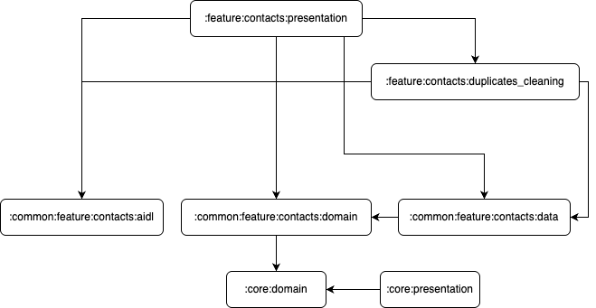
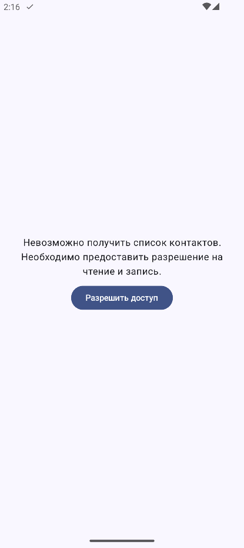
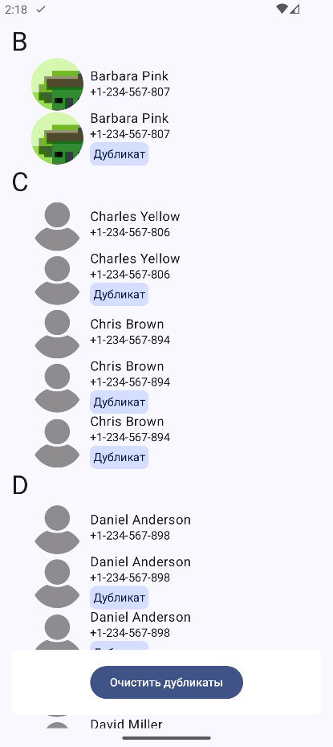
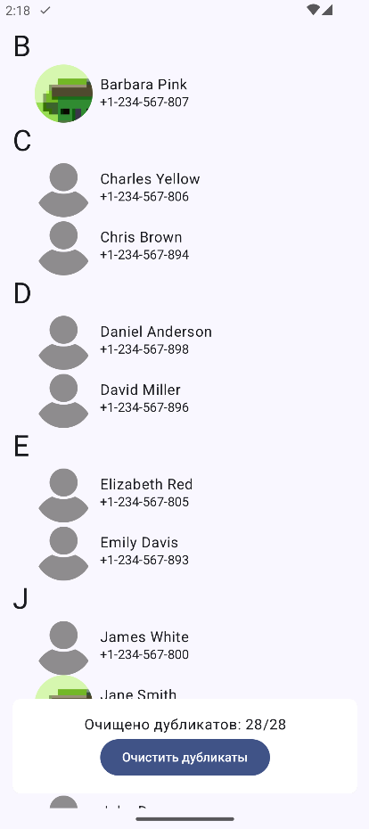
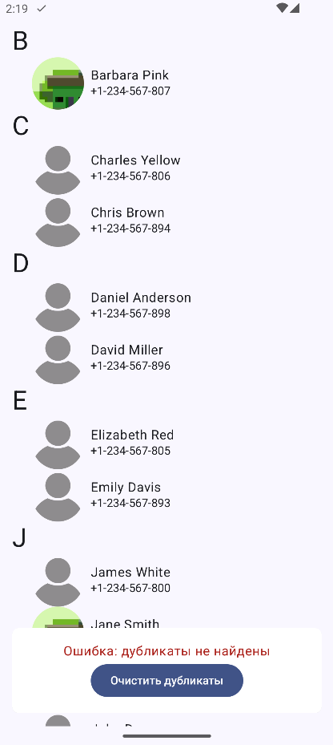

# MyContacts
Тестовое задание для стажировки Yadro impulse (Вариант 3). Приложение для просмотра контактов и удаления дубликатов

# Функционал
- Просмотр контактов
- Удаление контактов с помощью сервиса, взаимодействующим с приложением через AIDL

# Стэк
- Jetpack Compose
- AndroidX
- Coil
- toml-каталог
- Dagger 2
- KotlinX Serialization
- Jetpack Navigation
- Material Theming

# Архитектура
Приложение разработано с требованиями чистой архитектуры и использует разделение на модули. В приложении реализована единственная фича - "контакты"

``:core:domain`` - Содержит необходимые для всех модулей данные доменного слоя (ошибки, результаты операций и утилиты для работы с ресурсами)

``:core:presentation`` - Содержит необходимые для всех модулей данные слоя презентации (тема, утилиты для viewModel и общие экраны)

(Несколько модулей фичи контактов объединены в общий модуль, так как от них зависим более чем один модуль)

``:common:feature:contacts:domain`` - содержит доменные данные для фичи контактов (интерфейсы репозиториев и источников данных, usecase-ы, модели данных, обработку специфичных ошибок)

``:common:feature:contacts:data`` - содержит реализации интерфейсов и источников данных для фичи контактов

``:common:feature:contacts:aidl`` - содержит AIDL интерфейсы для сервиса удаления контактов

``:feature:contacts:presentation`` - презентационный слой фичи контактов. Содержит экран для просмотра контактов

``:feature:contacts:duplicates_cleaning`` - содержит сервис для очистки контактов

# Демонстрация

## Скриншоты

## Видео
Видео: https://youtube.com/shorts/fOb_2q188jc